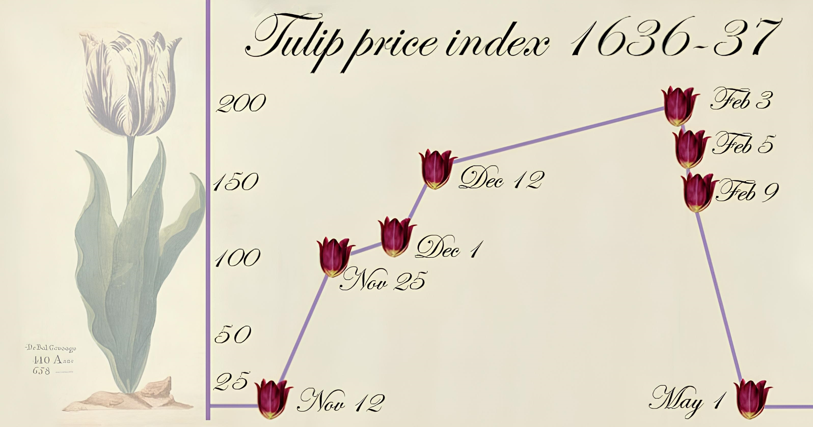

<br />
<div align="center">

  <h3 align="center">Tail-aware density forecasting of locally explosive time series: a neural network approach </h3>

  <p align="center">
   Elena Dumitrescu, Julien Peignon, Arthur Thomas (2026)
  </p>

  <p align="center">
    <a href="https://arxiv.org/abs/2601.14049"></a>
    <a href="https://www.python.org/downloads/"></a>
    <a href="https://pytorch.org/"></a>
    <a href="https://github.com/astral-sh/ruff"></a>
    <a href="https://creativecommons.org/licenses/by/4.0/"></a>
  </p>
</div>

<p align="justify">
Mixed causal–noncausal (anticipative) models capture locally explosive dynamics and provide economically meaningful probabilities of continuation and collapse, but forecasting with them remains computationally difficult. We develop a two-stage framework that estimates such an ARMA model and then learns its predictive density using a Mixture Density Network with skewed-<em>t</em> components, tail-aware training weights, and post-hoc calibration. The approach accommodates the heavy tails, asymmetry, and multimodality characteristic of non-causal forecasts while remaining computationally tractable. Monte Carlo experiments and a real-time natural-gas application show substantial improvements over existing density-forecasting methods.
</p>

<div align="center">
  <a>
    
  </a>
</div>
<br />

This repository holds the code behind the paper, available on [arXiv](https://arxiv.org/abs/2601.14049).

## Structure 📂

```text
.
├── data/                  # Henry Hub and CPI vintages, and the benchmark forecasts of Baumeister et al.
├── outputs/               # Scores of the runs behind the paper, by process, horizon and α
├── src/
│   ├── calibration/       # Local PIT recalibration (I-splines)
│   ├── conditional_theoretical_moments/
│   ├── evaluate/          # CDE loss, CRPS, weighted scores, Baumeister et al. benchmarks
│   ├── forecast_methods/  # MDN, KCDE, FlexZBoost, LLS2012, GJ2026, exact Gaussian AR/MA
│   ├── mcs/               # Per-observation losses and the Model Confidence Set
│   ├── plots/, recursive_forecasting/, stable_mar/, utils/
├── config.yaml            # Every α-stable, MAR/MARMA, model, Optuna and seed setting
├── simulations.py                    # Monte Carlo study against theoretical moments and densities
├── simulations_realized_outcomes.py  # Monte Carlo study against realised outcomes
├── applications.py                   # Recursive real-time forecasting of the gas price
├── sampled_trajectories.py           # Trajectories sampled from the recalibrated MDN density
└── MCS_tests.py                      # Model Confidence Set p-values from cached forecasts
```

## Usage 🚀

```bash
git clone https://github.com/JulienPeignon/MARMA-density-forecasting.git
cd MARMA-density-forecasting/
pip install -r requirements.txt
```

```bash
# MDN on a MAR(0,1) with alpha = 1.2, five steps ahead
python simulations.py --model mdn --order 0 1 --alpha 1.2 --horizon 5

# Recursive real-time forecasts of the gas price
python applications.py --model mdn --horizon 1 --evaluate

# Model Confidence Set from cached results
python MCS_tests.py all
```

`--evaluate` reloads a cached fit instead of retuning. `python <script>.py --help` lists the rest.

`outputs/` keeps the metrics and figures of the published runs. The paper's LaTeX sources are not part of this repository; see the [arXiv version](https://arxiv.org/abs/2601.14049).

## License 🔒

Shared under the Creative Commons Attribution 4.0 International License; see `LICENSE`.

## Contact 📞

For any questions or inquiries, please feel free to reach out to any of the authors.
